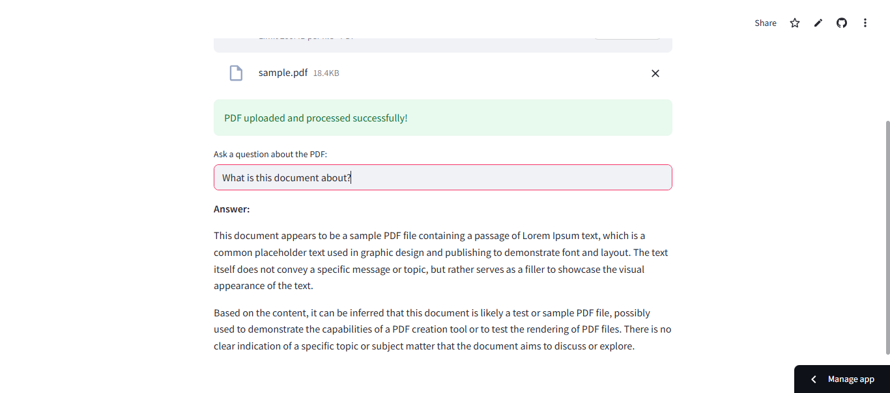

# 📄 Ask Your PDF
## AI-Powered PDF Question Answering using GROQ LLM

---

## 🚀 Overview

Ask Your PDF is a lightweight, production-ready Streamlit application that allows users to upload PDF documents and ask natural-language questions, receiving fast, context-aware answers powered by GROQ’s high-performance LLMs.


--- 

## 📦 Stack / Tech

• Python 3.10+<br>
• Streamlit<br>
• GROQ API (Meta LLaMA models)<br>
• PyPDF2<br>
• python-dotenv<br>
• Requests

---

## 🧠 What It Does

• Upload any PDF and interact with its contents using natural language<br>
• Extracts and processes document text in real time<br>
• Sends context-aware prompts to GROQ LLMs for fast responses<br>
• Maintains chat history with timestamps<br>
• Designed for simplicity, speed, and low overhead

---

## 🛠 Setup / Deployment

### 1️⃣ Clone the Repository

```bash
git clone https://github.com/Varun-Wagle/ask-your-pdf.git
cd ask-your-pdf
```

### 2️⃣ Create & Activate Virtual Environment (Recommended)

```bash
python -m venv venv
venv\Scripts\activate   # Windows
# source venv/bin/activate  # macOS/Linux
```

### 3️⃣ Install Dependencies

```bash
pip install -r requirements.txt
```

### 4️⃣ Configure Environment Variables

Create a .env file in the root directory:
```env
GROQ_API_KEY=your_groq_api_key_here
```

### 5️⃣ Run the Application

```bash
streamlit run app.py
```
The app will open automatically in your browser.

---

## 📁 Project Structure
```bash
ask-your-pdf/
│
├── app.py               # Main Streamlit application
├── requirements.txt     # Python dependencies
├── .env                 # GROQ API key (gitignored)
├── .gitignore
└── README.md
```

---

## 📊 Screenshots

### Homescreen


### Uploading a PDF


### File Uploaded


### Asking Questions


.png) .png)


### Chat History
.png) 

---

## 🏷 Releases / Tags

• v1.0 — Initial stable release 

---

## 📎 License

This project is licensed under the MIT License.

---

## 🤝 Contributions

Contributions, issues, and feature requests are welcome.
Feel free to open an issue or submit a pull request.

---

## ✨ Author

**Varun Wagle**<br>
[](https://github.com/Varun-Wagle)

---

## 🔎 Notes for Portfolio Reviewers

• Designed for clarity and speed over heavy abstraction<br>
• Easily extensible for embeddings, citations, or multi-PDF workflows<br>
• Demonstrates practical LLM integration with real user interaction<br>

---
